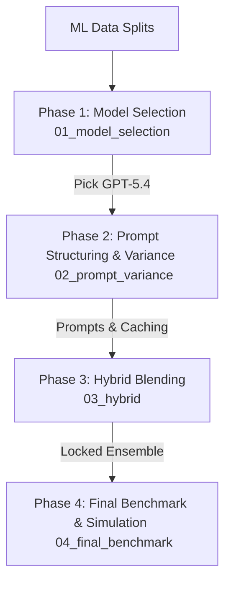

# LLM Engineering & Evaluation Pipeline

This directory houses the phased LLM experimentation, evaluation frameworks, and utility tools developed to benchmark Generative AI performance against traditional credit scoring models.

---

## Shared Utility Modules

To ensure absolute experimental reproducibility, all LLM notebooks draw from central helper modules:

* **`llm_utils.py`:** The core operational engine. Handles data loading, ML feature re-encoding, pricing metrics calculation, token count validation, API calls (wrapping OpenAI, Gemini, and Groq), prediction probability extraction via token logprobs, and automatic append-only logging to `data/results/llm/llm_calls.csv`.
* **`llm_pricing.py`:** The pricing catalog. Contains the official price list (USD per 1,000 input/output tokens) for all evaluated model families.
* **`sample_generation.py`:** Generates reproducible, mutually-exclusive datasets from LendingClub splits (`tuning_sample`, `robustness_batch`, `test_batch`), preserving target class ratios.

---

## Phased Pipeline Flow

### [Phase 1: Model Selection & Calibration](file:///Users/alemz/Projects/Github/Sabadell_Capstone/notebooks/llm_models/01_model_selection)
* **Goal:** Evaluate foundation models across multiple providers to pick the ideal platform and configuration.
* **Focus:** Provider comparisons (Gemini vs. Claude vs. GPT), description-impact studies (`±desc`), reasoning-effort sweeps, and confidence/calibration checks (Brier scores & ECE).
* **Gate:** Executive cost ledgers and qual-analysis fingerprints (`01f`).

### [Phase 2: Prompt Structuring & Variance](file:///Users/alemz/Projects/Github/Sabadell_Capstone/notebooks/llm_models/02_prompt_variance)
* **Goal:** Optimize prompting structure and minimize operational costs.
* **Focus:** Isolating formatting taxes (TOON syntax) and batching taxes, linguistic system prompt testing (7 variants), and OpenAI automatic prompt caching economics (50% input discount on prompts > 1,024 tokens).
* **Gate:** Prompt-variance cost ledgers and qual-analysis fingerprints (`02c`).

### [Phase 3: Hybrid Blended LLM/ML Approach](file:///Users/alemz/Projects/Github/Sabadell_Capstone/notebooks/llm_models/03_hybrid)
* **Goal:** Pipeline applications through a combination of classical ML (XGBoost) and high-reasoning LLMs.
* **Focus:** Soft-probability ensembling, confidence-gated routing, and Llama-3.3-70b/Groq execution. The test set remains strictly untouched here.

### [Phase 4: Final Benchmark & Yield Dashboards](file:///Users/alemz/Projects/Github/Sabadell_Capstone/notebooks/llm_models/04_final_benchmark)
* **Goal:** Establish final comparative benchmarks and translate predictive performance into commercial business metrics.
* **Focus:** Benchmark run of finalist models on the locked test set (`04b`), decision threshold tuning, post-hoc ensembling, and interactive portfolio simulations (`04a`) evaluating real bank yields ($ net profit).
